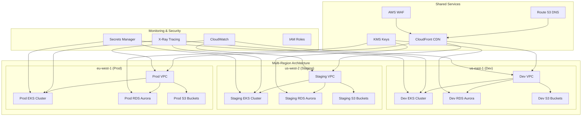

# Complete Infrastructure Diagram

This diagram shows the comprehensive multi-region architecture for the Terragrunt AWS infrastructure.

## Components

- **VPCs**: Isolated network environments per environment
- **EKS Clusters**: Kubernetes clusters for containerized applications
- **RDS Aurora**: Managed PostgreSQL/MySQL databases
- **S3 Buckets**: Object storage for static assets and backups
- **CloudFront**: Global CDN for content delivery
- **Route 53**: DNS management and health checks
- **AWS WAF**: Web application firewall
- **KMS**: Encryption key management
- **CloudWatch**: Monitoring and logging
- **X-Ray**: Distributed tracing
- **Secrets Manager**: Secure credential storage
- **IAM**: Identity and access management
