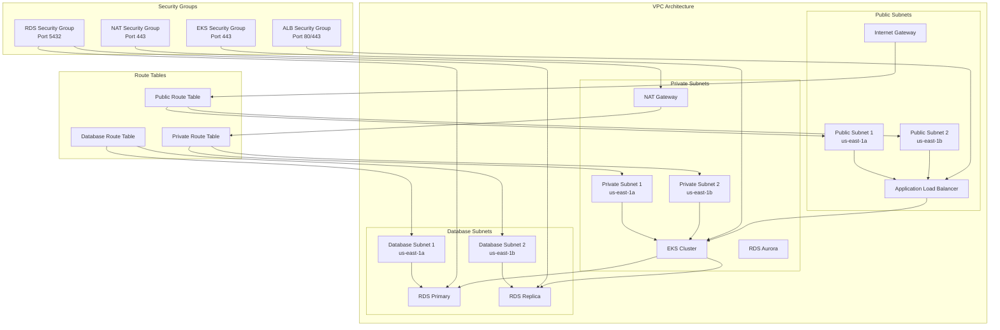

# Network Topology Diagram

This diagram shows the VPC, subnets, and security architecture for the Terragrunt AWS infrastructure.

## Network Security

- **Public Subnets**: Host load balancers and NAT gateways
- **Private Subnets**: Host application workloads (EKS)
- **Database Subnets**: Host RDS instances with no internet access
- **Security Groups**: Control traffic between components
- **Route Tables**: Manage traffic routing within VPC
- **NAT Gateway**: Provides outbound internet access for private subnets
