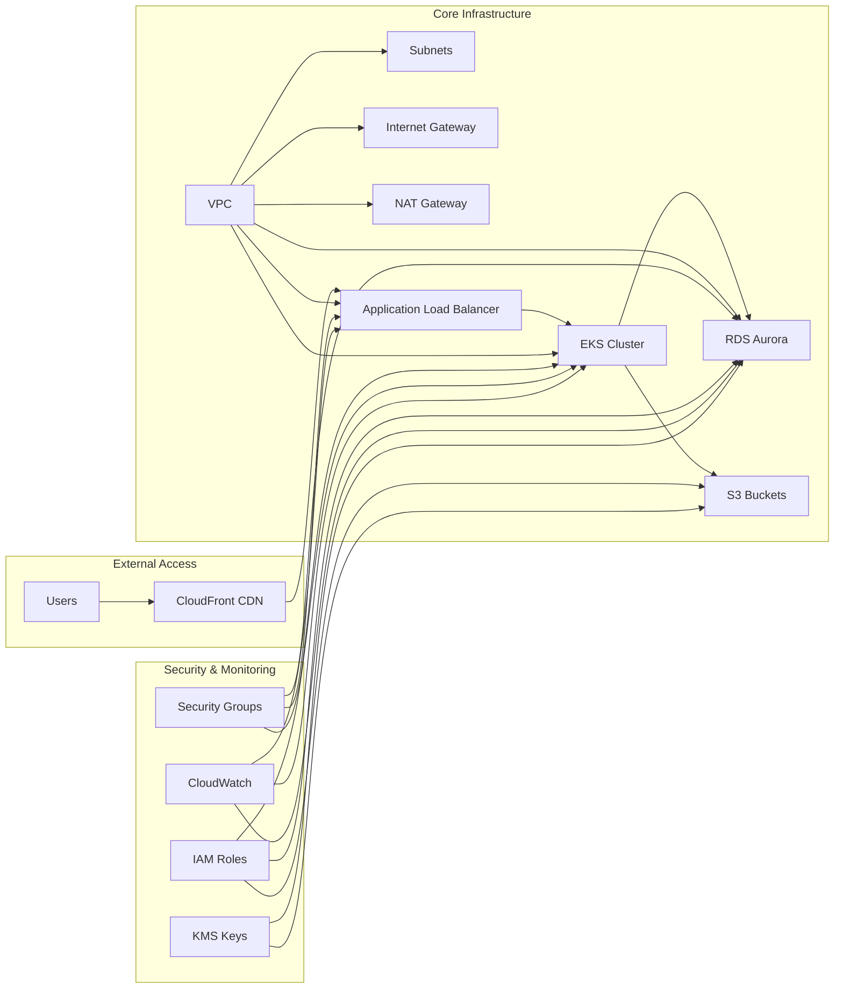

# Simple Infrastructure Overview

This diagram shows the core components and data flow for the Terragrunt AWS infrastructure.

## Data Flow

1. **Users** access the application through **CloudFront CDN**
2. **CloudFront** routes requests to **Application Load Balancer**
3. **ALB** distributes traffic to **EKS Cluster** pods
4. **EKS** applications connect to **RDS Aurora** for data
5. **EKS** applications store files in **S3 Buckets**
6. **Security Groups** control network access
7. **IAM Roles** manage permissions
8. **CloudWatch** monitors all components
9. **KMS** encrypts data at rest
